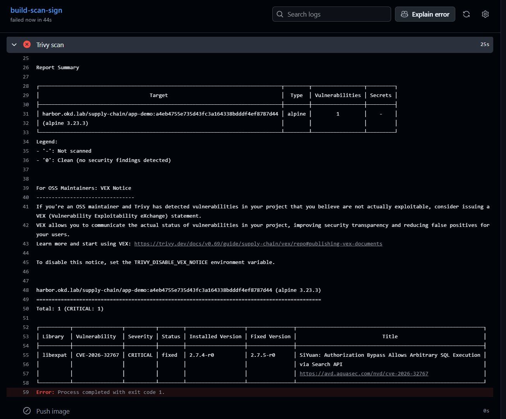
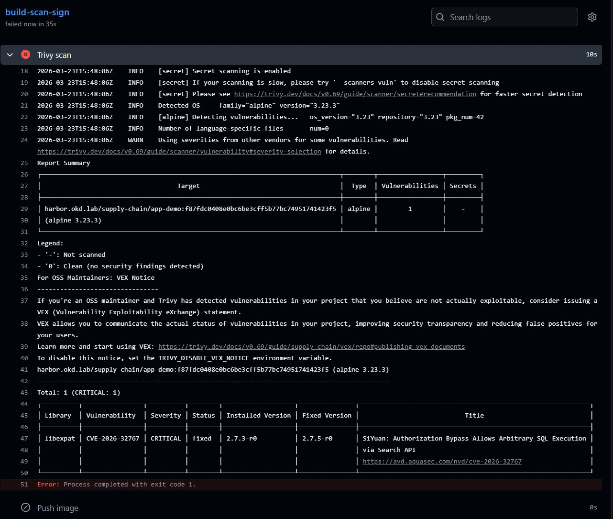
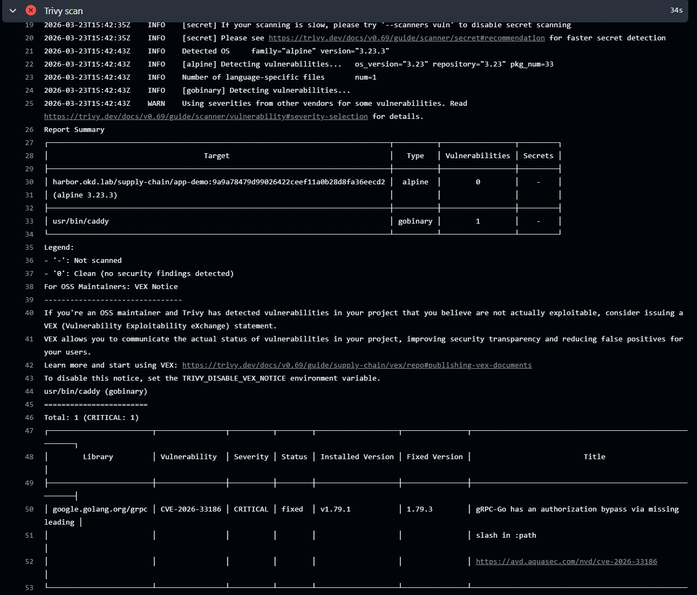

# ADR-003 — Choix image de base : nginx → caddy → httpd

**Date** : 2026-03-23  
**Statut** : Accepté

## Contexte

L'application de démonstration est une page HTML statique servie par un serveur web. Le gate Trivy bloque toute image avec une CVE CRITICAL avant le push vers Harbor.

## Tentatives successives

### Tentative 1 — nginx:alpine ❌

```
CVE-2026-32767 | CRITICAL | libexpat 2.7.4-r0 → 2.7.5-r0
SiYuan: Authorization Bypass Allows Arbitrary SQL Execution via Search API
```



### Tentative 2 — caddy:alpine ❌

```
CVE-2026-33186 | CRITICAL | google.golang.org/grpc v1.79.1 → 1.79.3
gRPC-Go: authorization bypass via missing leading slash in :path
```



### Tentative 3 — httpd:alpine + apk upgrade ✅

```dockerfile
FROM harbor.okd.lab/library/httpd:alpine
# Fix CVE-2026-32767 - libexpat upgrade
RUN http_proxy=http://10.128.0.2:8888 \
    https_proxy=http://10.128.0.2:8888 \
    apk upgrade --no-cache libexpat
COPY src/ /usr/local/apache2/htdocs/
EXPOSE 80
```

**Résultat** : 0 vulnerabilities CRITICAL ✅



## Décision

Utiliser **httpd:alpine** avec upgrade explicite de `libexpat` dans le Dockerfile.

## Justification

Le pattern enterprise correct est de **fixer la CVE dans le Dockerfile** plutôt que :
- Chercher une image sans CVE (impossible à garantir dans le temps)
- Désactiver le gate Trivy (anti-pattern)
- Ignorer les CVE CRITICAL (risque de sécurité)

## Note

La racine du problème est **Alpine 3.23.3** qui embarque `libexpat 2.7.3-r0` non patché. Toutes les images basées sur Alpine 3.23.3 sont affectées jusqu'à ce qu'Alpine publie le patch dans son index.

## Leçon portfolio

Ce parcours nginx → caddy → httpd démontre concrètement que :
1. Le gate Trivy fonctionne réellement en production
2. Les CVE CRITICAL sont omniprésentes dans les images récentes
3. La bonne réponse est de patcher, pas d'ignorer
