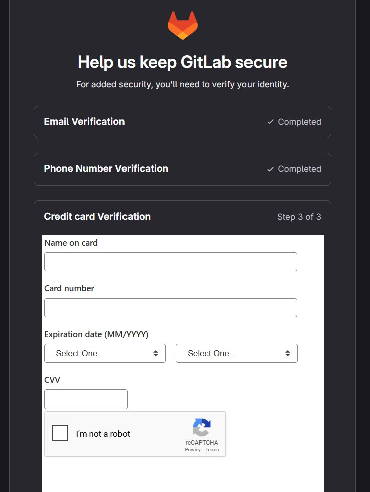
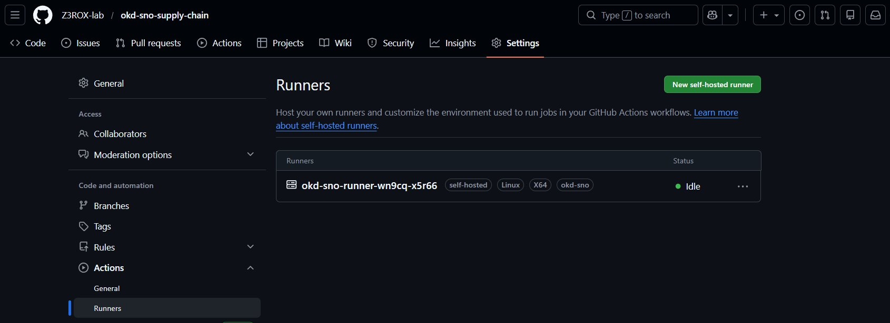
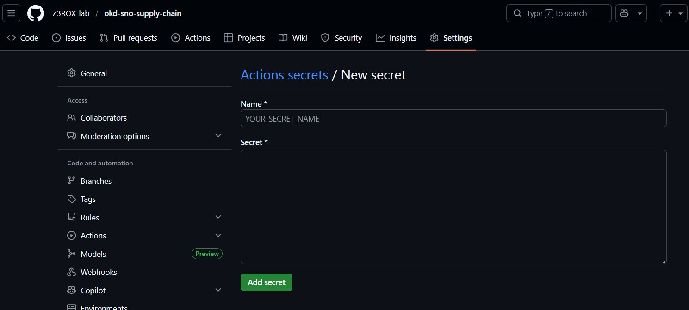
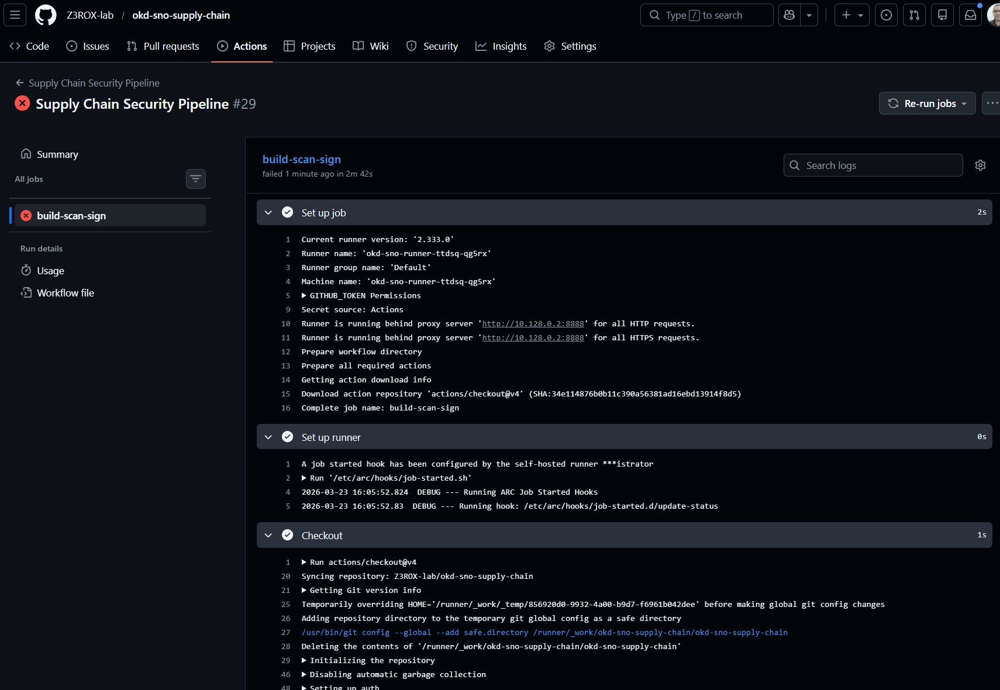
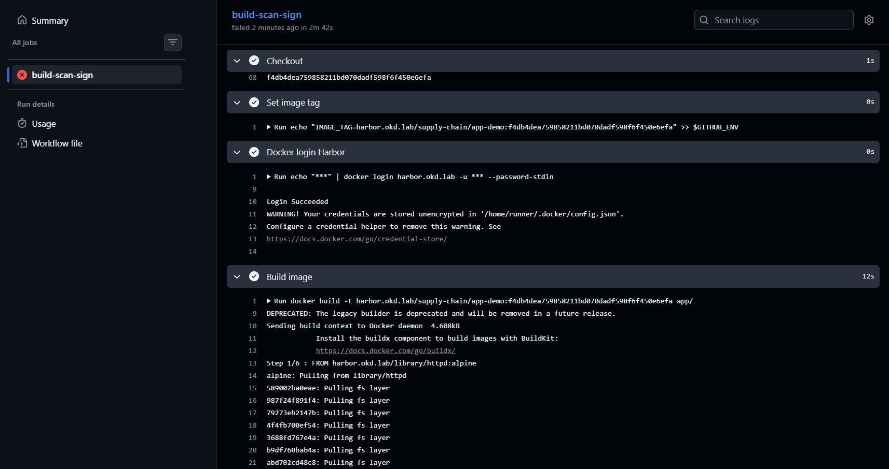
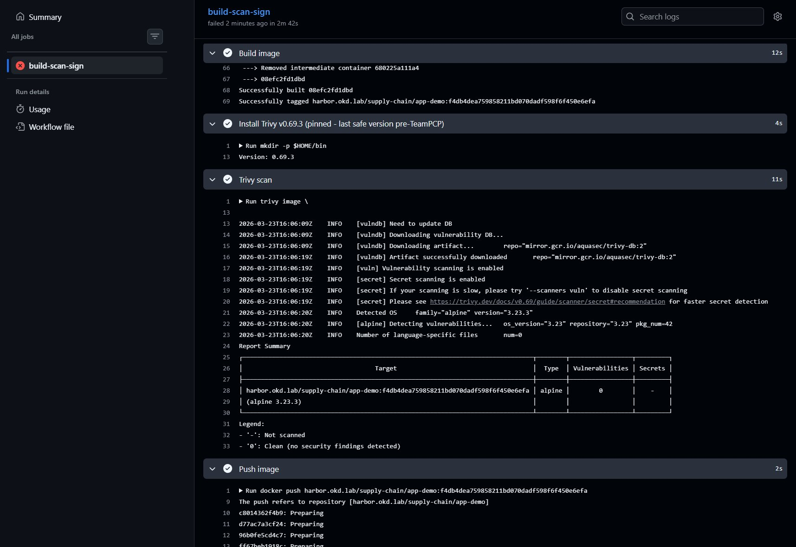
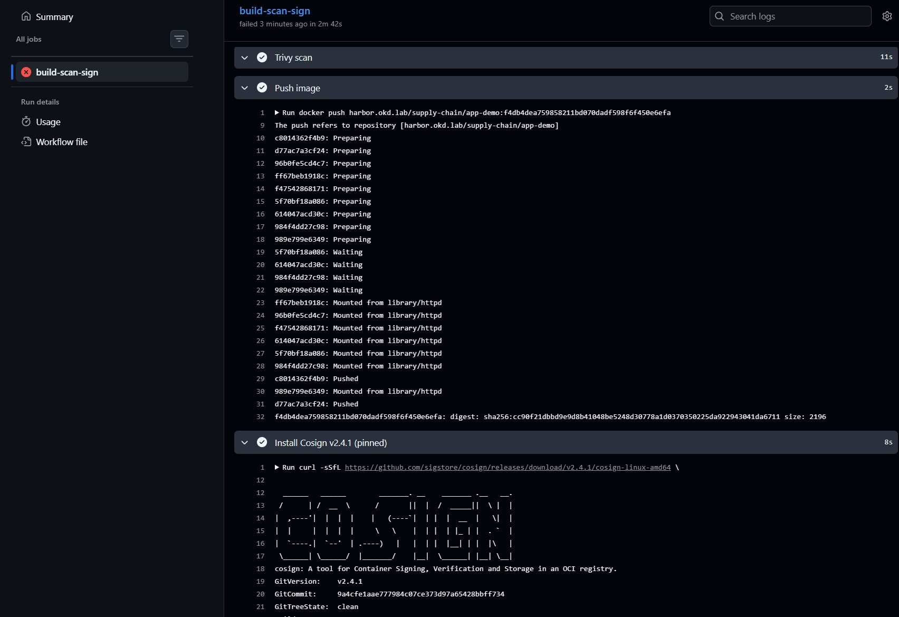
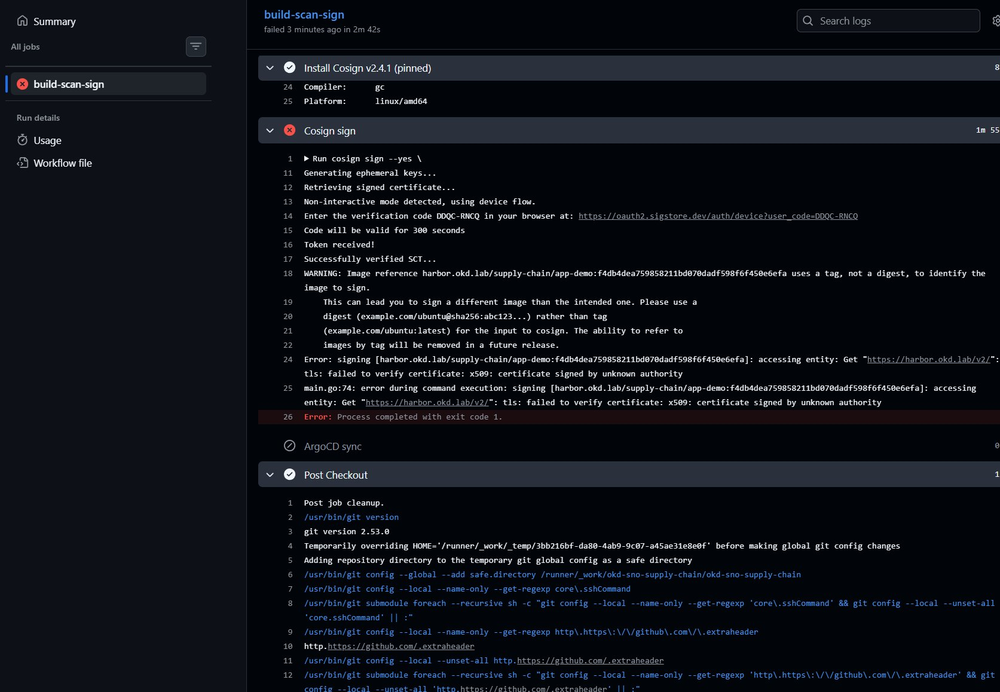

# Phase 5 — Supply Chain Security Pipeline

## Vue d'ensemble

Cette phase implémente une chaîne CI/CD sécurisée complète sur OKD SNO :

```
GitHub.com (SaaS)
    │
    │  push → déclenche workflow
    ▼
.github/workflows/supply-chain.yml
    │
    │  job dispatché au runner
    ▼
GitHub Actions Self-hosted Runner (pod OKD)
    │
    ├── 1. git clone
    ├── 2. docker build    ← image depuis Harbor (base image mirrorée)
    ├── 3. trivy scan      ← gate CRITICAL=0
    ├── 4. docker push     ← vers Harbor supply-chain/app-demo
    ├── 5. cosign sign     ← signature keyless Sigstore
    └── 6. argocd sync     ← déploiement GitOps
              │
              ▼
    Harbor (harbor.okd.lab)
    supply-chain/app-demo:<sha>
              │
              ▼
    OKD SNO — pod app-demo
    Kyverno vérifie signature ✅
```

---

## Décision : GitHub Actions vs GitLab CI

### Pourquoi pas GitLab.com ?

GitLab.com imposait une vérification par carte de crédit pour activer les CI/CD pipelines, même pour les runners self-hosted. Cette friction administrative a motivé le choix de GitHub Actions.



### Pourquoi GitHub Actions ?

- Compte `Z3ROX-lab` déjà existant avec le portfolio
- Zéro friction pour s'inscrire
- Pattern enterprise très répandu : SaaS Git + runners on-premise
- Même chaîne supply chain : build → Trivy → Cosign → Harbor → ArgoCD

> Voir [ADR-001 : GitHub Actions vs GitLab CI](decisions/ADR-001-github-vs-gitlab.md)

---

## Architecture du Runner

```
┌─────────────────────────────────────────────────────────────────┐
│  OKD SNO — namespace: actions-runner-system                    │
│                                                                 │
│  ┌──────────────────────────────────────────────────────────┐  │
│  │  Pod: okd-sno-runner-xxxx                                │  │
│  │                                                          │  │
│  │  ┌─────────────────────┐  ┌──────────────────────────┐  │  │
│  │  │  container: runner  │  │  container: docker (DinD) │  │  │
│  │  │                     │  │                          │  │  │
│  │  │  - poll GitHub API  │  │  - docker build          │  │  │
│  │  │  - git clone        │  │  - docker push           │  │  │
│  │  │  - execute steps    │──▶  - docker login          │  │  │
│  │  │  - curl/bash        │  │  - storage driver: vfs   │  │  │
│  │  │  - trivy            │  │                          │  │  │
│  │  │  - cosign           │  │  daemon.json:            │  │  │
│  │  └─────────────────────┘  │  insecure-registries:    │  │  │
│  │                           │  ["harbor.okd.lab"]      │  │  │
│  │                           └──────────────────────────┘  │  │
│  └──────────────────────────────────────────────────────────┘  │
│                                                                 │
│  ARC Controller (Actions Runner Controller)                    │
│  ├── Helm install direct (pas via ArgoCD)                      │
│  └── Raison: ClusterRole incompatible mode namespaced ArgoCD   │
└─────────────────────────────────────────────────────────────────┘
```

> Voir [ADR-002 : ARC Helm vs ArgoCD](decisions/ADR-002-arc-helm-vs-argocd.md)

---

## Installation ARC (Actions Runner Controller)

### Prérequis

```bash
export KUBECONFIG=~/work/okd-sno-install/auth/kubeconfig

# Namespace
oc new-project actions-runner-system

# Secret GitHub PAT
oc create secret generic controller-manager \
  --from-literal=github_token=<GITHUB_PAT> \
  -n actions-runner-system

# SCC privileged pour DinD
oc adm policy add-scc-to-user privileged \
  -z default \
  -n actions-runner-system
```

### Installation Helm (depuis WSL2 — internet direct)

```bash
helm repo add actions-runner-controller \
  https://actions-runner-controller.github.io/actions-runner-controller

helm repo update

helm upgrade --install actions-runner-controller \
  actions-runner-controller/actions-runner-controller \
  --namespace actions-runner-system \
  --set authSecret.create=false \
  --set authSecret.name=controller-manager \
  --set certManagerEnabled=false \
  --version 0.23.7 \
  --set env[0].name=HTTPS_PROXY \
  --set env[0].value=http://10.128.0.2:8888 \
  --set env[1].name=HTTP_PROXY \
  --set env[1].value=http://10.128.0.2:8888 \
  --set env[2].name=NO_PROXY \
  --set "env[2].value=192.168.241.0/24\,harbor.okd.lab\,.cluster.local\,kubernetes.default.svc\,10.0.0.0/8"
```

> ⚠️ **Important** : Le proxy tinyproxy (`10.128.0.2:8888`) est accessible uniquement depuis les pods OKD.
> Depuis WSL2, utiliser internet direct (ne pas exporter HTTPS_PROXY).

### RunnerDeployment

```yaml
# manifests/actions-runner/runner-deployment.yaml
apiVersion: actions.summerwind.dev/v1alpha1
kind: RunnerDeployment
metadata:
  name: okd-sno-runner
  namespace: actions-runner-system
spec:
  replicas: 1
  template:
    spec:
      repository: Z3ROX-lab/okd-sno-supply-chain
      labels:
        - okd-sno
      env:
        - name: HTTPS_PROXY
          value: http://10.128.0.2:8888
        - name: HTTP_PROXY
          value: http://10.128.0.2:8888
        - name: NO_PROXY
          value: 192.168.241.0/24,harbor.okd.lab,.cluster.local,kubernetes.default.svc,10.0.0.0/8
      hostAliases:
        - ip: "192.168.241.20"
          hostnames:
            - "harbor.okd.lab"
      dockerVolumeMounts:
        - name: docker-daemon-config
          mountPath: /etc/docker/daemon.json
          subPath: daemon.json
        - name: combined-ca
          mountPath: /etc/ssl/certs/ca-certificates.crt
          subPath: ca-certificates.crt
      volumes:
        - name: docker-daemon-config
          configMap:
            name: docker-daemon-config
        - name: combined-ca
          configMap:
            name: combined-ca
```

### Runner connecté — Status: Idle ✅



---

## GitHub Secrets configurés

Les secrets sont stockés chiffrés dans GitHub — jamais en clair dans le code.

| Secret | Description |
|--------|-------------|
| `HARBOR_USERNAME` | Utilisateur Harbor (admin) |
| `HARBOR_PASSWORD` | Mot de passe Harbor admin |
| `HARBOR_CA` | Certificat CA Harbor (auto-signé Z3ROX Lab) |
| `ARGOCD_TOKEN` | Token ArgoCD pour sync app-demo |



---

## Pipeline Supply Chain

### Fichier `.github/workflows/supply-chain.yml`

```yaml
name: Supply Chain Security Pipeline

on:
  push:
    branches: [master]
  workflow_dispatch:

env:
  HARBOR_REGISTRY: harbor.okd.lab
  HARBOR_PROJECT: supply-chain
  IMAGE_NAME: app-demo

jobs:
  build-scan-sign:
    runs-on: [self-hosted, okd-sno]
    
    steps:
      - name: Checkout
        uses: actions/checkout@v4

      - name: Set image tag
        run: echo "IMAGE_TAG=..." >> $GITHUB_ENV

      - name: Docker login Harbor
        run: echo "${{ secrets.HARBOR_PASSWORD }}" | docker login ...

      - name: Build image
        run: docker build -t ${{ env.IMAGE_TAG }} app/

      - name: Install Trivy v0.69.3 (pinned - last safe version pre-TeamPCP)
        run: |
          curl -sL https://github.com/aquasecurity/trivy/releases/download/v0.69.3/...
          
      - name: Trivy scan         # GATE : bloque si CRITICAL > 0
        run: trivy image --exit-code 1 --severity CRITICAL ...

      - name: Push image
        run: docker push ${{ env.IMAGE_TAG }}

      - name: Install Cosign v2.4.1 (pinned)
        run: curl -sSfL https://github.com/sigstore/cosign/...

      - name: Cosign sign        # Signature keyless Sigstore
        run: cosign sign --yes ${{ env.IMAGE_TAG }}

      - name: ArgoCD sync
        run: argocd app sync app-demo ...
```

---

## Trivy Gate — Démonstration

Le gate Trivy a bloqué 3 images successives avec des CVE CRITICAL — démonstration réelle de la supply chain security.

### Tentative 1 — nginx:alpine ❌

```
libexpat | CVE-2026-32767 | CRITICAL | fixed | 2.7.4-r0 → 2.7.5-r0
SiYuan: Authorization Bypass Allows Arbitrary SQL Execution via Search API
```


### Tentative 2 — caddy:alpine ❌

```
google.golang.org/grpc | CVE-2026-33186 | CRITICAL | fixed | v1.79.1 → 1.79.3
gRPC-Go has an authorization bypass via missing leading slash in :path
```


### Solution — httpd:alpine + apk upgrade ✅

```dockerfile
FROM harbor.okd.lab/library/httpd:alpine
# Fix CVE-2026-32767 - libexpat upgrade via proxy
RUN http_proxy=http://10.128.0.2:8888 \
    https_proxy=http://10.128.0.2:8888 \
    apk upgrade --no-cache libexpat
COPY src/ /usr/local/apache2/htdocs/
EXPOSE 80
```

**Résultat : 0 vulnerabilities** ✅


> Voir [ADR-003 : Choix image base — nginx→caddy→httpd](decisions/ADR-003-base-image-selection.md)

---

## Incident Supply Chain : TeamPCP / Trivy Attack (19 mars 2026)

> Voir [ADR-004 : Trivy version pinning post-TeamPCP](decisions/ADR-004-trivy-teampcp.md)

### Chronologie

```
Fin février 2026  → Attaquant "TeamPCP" vole un PAT GitHub via
                    misconfiguration pull_request_target workflow

19 mars 2026      → Force-push 76/77 tags aquasecurity/trivy-action
                    → Tous redirigés vers infostealer
                    → Publication binaire malveillant v0.69.4
                    → Exfiltration secrets CI/CD via scan.aquasecurtiy[.]org

20 mars 2026      → Aqua Security détecte et nettoie
                    → v0.69.3 déclarée dernière version sûre (immutable)

22 mars 2026      → Images Docker Hub 0.69.5/0.69.6 aussi compromises
                    → Worm CanisterWorm via npm tokens volés
```

### Impact sur notre pipeline

```
✅ NON affecté — on utilise v0.69.3 pinnée (pré-attaque)
✅ Installation via curl direct (pas via aquasecurity/setup-trivy)
✅ Version immutable GitHub releases
```

### Leçon clé

```yaml
# ❌ UNSAFE — tag mutable, peut être redirigé
uses: aquasecurity/trivy-action@v0.69.4

# ✅ SAFE — version pinnée + téléchargement direct
curl -sL https://github.com/aquasecurity/trivy/releases/download/v0.69.3/trivy_0.69.3_Linux-64bit.tar.gz
```

---

## Pipeline final — État des étapes






### État actuel

| Étape | Status | Notes |
|-------|--------|-------|
| Checkout | ✅ | |
| Docker login Harbor | ✅ | CA via configMap DinD |
| Build image | ✅ | httpd:alpine + libexpat fix |
| Trivy scan | ✅ | 0 CRITICAL |
| Push Harbor | ✅ | supply-chain/app-demo |
| Cosign sign | ⚠️ | TLS Harbor CA à configurer |
| ArgoCD sync | 🔄 | Pending Cosign fix |

### Cosign TLS — Problème en cours

Cosign refuse de signer vers un registry dont le CA n'est pas reconnu — c'est une protection intentionnelle contre les attaques MITM.



**Fix en cours** : injection du CA Harbor dans le store système du runner via `update-ca-certificates`.

---

## Problèmes rencontrés et solutions

### 1. ARC — namespaced mode incompatible ClusterRole

**Erreur** : `cluster level ClusterRole can not be managed when in namespaced mode`

**Solution** : Installation ARC via Helm direct depuis WSL2 (pas via ArgoCD)

### 2. Docker DinD — overlay2 non supporté

**Erreur** : `failed to mount overlay: invalid argument`

**Solution** : `storage-driver: vfs` dans daemon.json + SCC privileged

### 3. harbor.okd.lab DNS non résolu dans runner

**Solution** : `hostAliases` dans RunnerDeployment

### 4. TLS Harbor CA non reconnu

**Solution** : CA Harbor injecté dans `/etc/ssl/certs/ca-certificates.crt` du container DinD via ConfigMap

### 5. Proxy WSL2 mal configuré

**Erreur** : `curl: (28) Failed to connect to 10.128.0.2 port 8888`

**Cause** : `HTTPS_PROXY` exporté dans le terminal WSL2 alors que tinyproxy n'est accessible que depuis les pods OKD.

**Solution** : `unset HTTPS_PROXY HTTP_PROXY http_proxy https_proxy` dans WSL2

---

## Références

- [ARC Documentation](https://github.com/actions-runner-controller/actions-runner-controller)
- [Cosign Keyless Signing](https://docs.sigstore.dev/cosign/keyless/)
- [TeamPCP Trivy Attack — Wiz Blog](https://www.wiz.io/blog/trivy-compromised-teampcp-supply-chain-attack)
- [GitHub Advisory GHSA-69fq-xp46-6x23](https://github.com/aquasecurity/trivy/security/advisories/GHSA-69fq-xp46-6x23)
